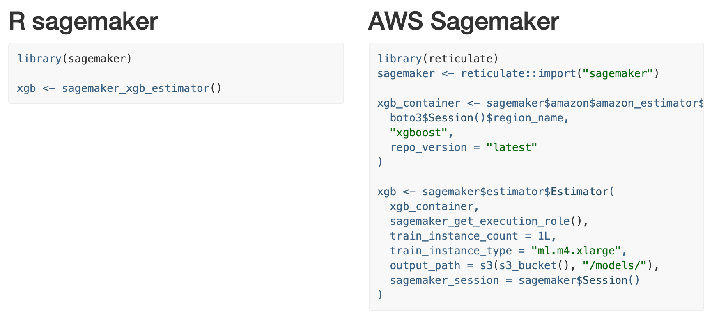
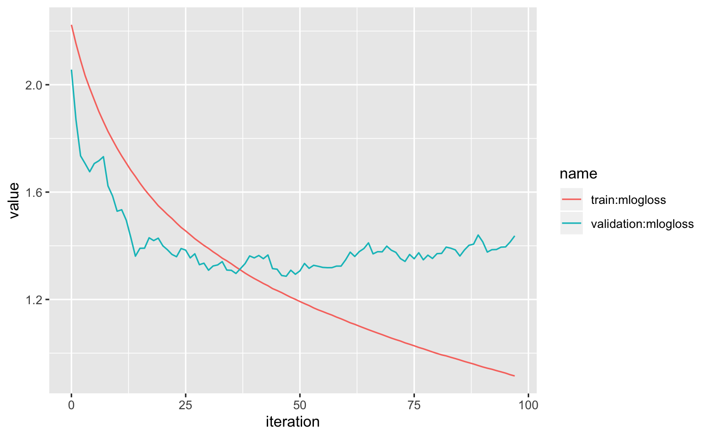

<!-- README.md is generated from README.Rmd. Please edit that file -->

# sagemaker

<!-- badges: start -->

<!-- badges: end -->

The sagemaker R package provides a simplified interface to the AWS
Sagemaker API by:

1.  adding sensible defaults so you can dive in quickly

2.  creating helper functions to streamline model analysis

3.  supporting `data.frame`s and
    [tibbles](https://github.com/tidyverse/tibble)

Check out the [Get
started](https://tmastny.github.io/sagemaker/articles/sagemaker.html)
guide for examples\!

## Less boilerplate

Compare [the AWS Sagemaker API vs. the sagemaker R
package](https://tmastny.github.io/sagemaker/articles/sagemaker-vs-sagemaker.html).

The R package hides the details for later, and lets you get started
ASAP.

[](https://tmastny.github.io/sagemaker/articles/sagemaker-vs-sagemaker.html)

## Easier predictions

Get Sagemaker endpoint predictions with no string parsing or REST API
management. Directly use `predict` on the Sagemaker model to get
predictions that conform to the
[tidymodel](https://tidymodels.github.io/parsnip/reference/predict.model_fit.html)
standard.

``` r
model <- sagemaker_hyperparameter_tuner(xgb, s3_split(train, validation))
pred <- predict(model, new_data)
```

Even download and load Sagemaker trained models into your R session:
TODO: link to local models

``` r
local_model <- sagemaker_load_model(model)
local_pred <- predict(local_model, new_data)
```

## Analyze tuning and fit

Easily get tuning and training stats with `sagemaker_training_job_logs`
and `sagemaker_tuning_job_logs`.



## Installation

You can install sagemaker from [GitHub](https://github.com/) with:

``` r
# install.packages("devtools")
devtools::install_github("tmastny/sagemaker")
```

You will also need `boto3`, `sagemaker`, and `awscli` python packages.
If you don’t have them, or aren’t sure, install with:

``` r
sagemaker::sagemaker_install()
```

Next, you’ll need an [AWS
account](https://aws.amazon.com/premiumsupport/knowledge-center/create-and-activate-aws-account/).
This is a complicated process and unfortunately I don’t have a good
guide to share. Please reach out if you find one and I’ll post it here\!

Once you have the account and user setup you’ll want to save your
account access keys.
[This](https://www.viget.com/articles/set-up-aws-cli-and-download-your-s3-files-from-the-command-line/)
is a good guide to follow.

Lastly, you need a AWS Sagemaker Execution Role. The easiest way is to
create a AWS Sagemaker Notebook Instance. Try [this
guide](https://sagemaker-workshop.com/introduction/notebook.html#launch-the-notebook-instance)
to get the notebook running. Once the notebook is deployed, *inside the
instance* run:

``` python
from sagemaker import get_execution_role

role = get_execution_role()
print(role)
```

Once you have that role, run this command locally to save it with your
local AWS config:

``` r
sagemaker::sagemaker_save_execution_role(
  "arn:aws:iam::[account_number]:role/service-role/[SageMakerExecutionRole]"
)
```
